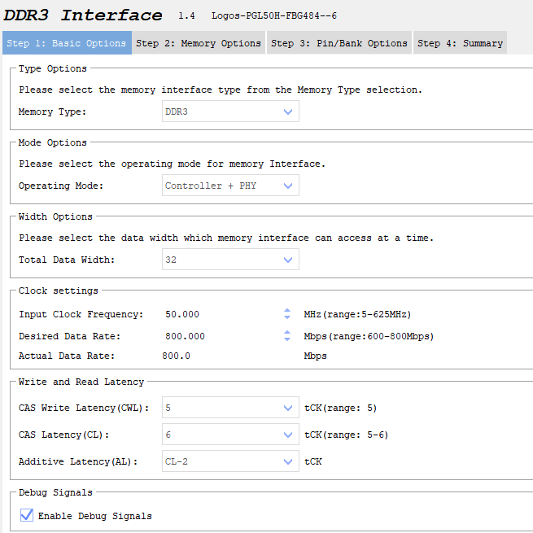
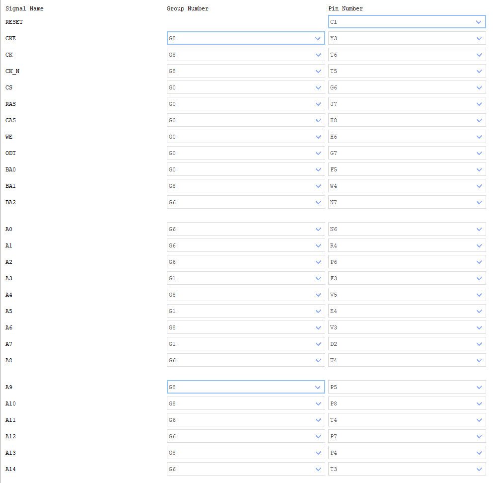
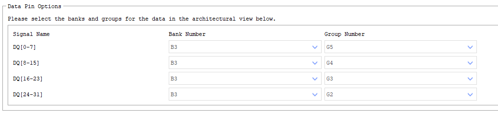
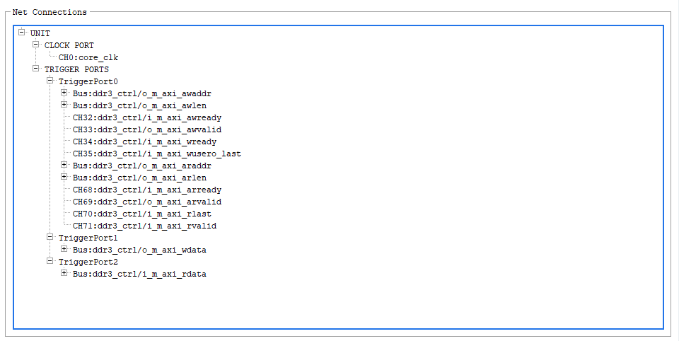
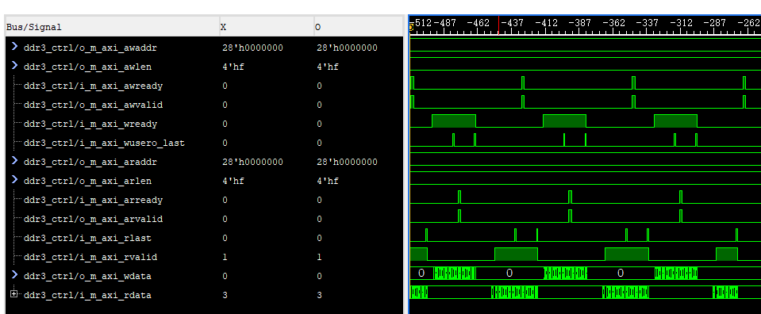

<!--
 * @Description: 
 * @Author: Tomood
 * @Date: 2024-06-05 22:32:12
 * @LastEditors: Tomood
 * @LastEditTime: 2024-06-05 22:50:12
 * @FilePath: \undefinede:\FPGA\Pango_ddr3_axi_demo\README.md
 * Copyright (c) 2024 by Tomood, All Rights Reserved. 
-->
# 紫光同创Pango 50K DDR IPcore 工程构建参考Demo

## 1.使用PDS工具生成IP核

输入时钟选用osc输入50MHz时钟，IP内部包含PLL，可以生成合适的时钟供DDR芯片以及用户接口使用。

#### **Step 1**

在本页中把数据位宽改成32，其他保持不变即可。



#### **Step 2**

第二页不需要进行任何设置

#### **Step 3**

勾选**Custom Control/Address Group**，并按以下图片中绑定Group和Pin





#### **Step 4**

本页不需要进行任何设置。

检查配置确认全部正确后，点击**Generate**生成IP。

## 2.导入AXI控制器和顶层文件

在测试用例中，包含以下两个模块：

①ddr3_ctrl.v : 此模块用于产生符合axi接口时序的控制与数据信号，对DDR芯片进行读写功能测试。

②ddr3_axi_test.v ： 工程顶层文件。例化紫光DDR3 IPcore 以及 ddr3_ctrl 控制模块。

将上述两模块导入pds目标工程源码目录中。

## 3.导入FDC约束文件

注意：下面代码须添加至约束文件中，以防止在布局布线阶段出现**Place-0007: DLL u_ddr3_ip/u_ddrphy_top/I_GTP_DLL/gopdll cannot be placed, refer DQS u_ddr3_ip/u_ddrphy_top/ddrphy_slice_top/i_ca_group[0].u_ddc_ca/opit_0.**报错

请根据ddr3ip例化的命名修改约束中的信号名称，若命名不同，不要直接复制以下代码~

```verilog
###==== BEGIN Attributes
define_attribute {i:u_ddr3_ip.u_ipsxb_ddrphy_pll_0.u_pll_e3} {PAP_LOC} {PLL_158_199}
define_attribute {i:u_ddr3_ip.u_ipsxb_ddrphy_pll_1.u_pll_e3} {PAP_LOC} {PLL_158_179}
define_attribute {i:u_ddr3_ip.u_ddrphy_top.ddrphy_reset_ctrl.ddrphy_ioclk_gate} {PAP_LOC} {CLMA_150_192:FF3}
###==== END Attributes
```

关于fdc文件中的其他类目，可参考本工程目录中的fdc文件。

## 4.创建Debug文件

要验证IP以及axi控制器是否正常工作，须使用DebugCore。

Clock使用IP返回的用户逻辑时钟 **core_clk** ，在TriggerPort中依次加入以下信号：

```verilog
  //axi写地址信号
  wire o_m_axi_awaddr;   
  wire o_m_axi_awlen;    
  wire i_m_axi_awready; 
  wire o_m_axi_awvalid;  
  //axi写数据信号
  wire o_m_axi_wdata;     
  wire i_m_axi_wready;   
  wire i_m_axi_wusero_last;
  //axi读地址信号
  wire o_m_axi_araddr;  
  wire o_m_axi_arlen;   
  wire i_m_axi_arready;
  wire o_m_axi_arvalid; 
  //axi读数据信号
  wire i_m_axi_rdata;  
  wire i_m_axi_rlast;  
  wire i_m_axi_rvalid; 
```



本例各采样通道信号链接关系如上图所示。

选择合适的采样深度，保存fic文件，重新跑完编译综合等程序，生成BitStream。

## 5.Dubugger抓波形

在Dubugger中下载程序，并加载fic文件，运行采样并查看波形。



若测试数据能够写入DDR，并可通过总线读出，则测试通过。

至此，DDR IP core工程构建完成。
